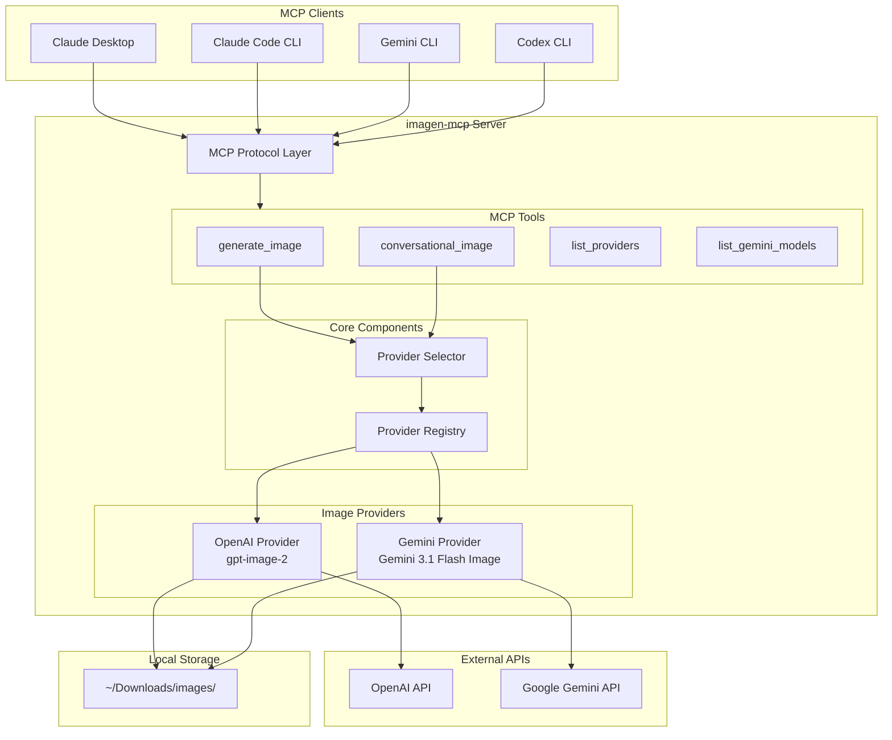

# imagen-mcp

A Model Context Protocol (MCP) server for intelligent multi-provider image generation.

[](https://github.com/michaeljabbour/imagen-mcp/actions/workflows/ci.yml)
[](https://www.python.org/downloads/)
[](https://opensource.org/licenses/MIT)

## Quick Start

Version 0.4.0 is released as the immutable `v0.4.0` Git tag and is not
published on PyPI. Install it from that tag or a local checkout, then run the
canonical module or console script:

```bash
git clone https://github.com/michaeljabbour/imagen-mcp.git
cd imagen-mcp
python3 -m pip install .
python -m imagen_mcp
# equivalent after installation: imagen-mcp
```

For a reproducible VCS install, use the release tag:

```bash
python3 -m pip install \
  "imagen-mcp @ git+https://github.com/michaeljabbour/imagen-mcp.git@v0.4.0"
```

The historical `python -m src.server` entry point remains available for
compatibility in 0.4.x.

See [`CHANGELOG.md`](CHANGELOG.md) for release details and migration notes.

**1. Get an API key** (at least one):

| Provider | Get a key at | Environment variable |
|----------|-------------|---------------------|
| OpenAI | [platform.openai.com/api-keys](https://platform.openai.com/api-keys) | `OPENAI_API_KEY` |
| Google Gemini | [aistudio.google.com/apikey](https://aistudio.google.com/apikey) | `GEMINI_API_KEY` |

> Having **both** keys lets auto-selection use either provider. With only one
> key, soft preferences may fall back with a notice. An unavailable explicit
> provider pin fails closed; in auto mode, Gemini-only requirements such as
> reference images and Google Search grounding also fail closed rather than
> silently dropping the requested capability.

**2. Add to your MCP client** (pick one):

<details>
<summary><strong>Claude Code</strong></summary>

```bash
claude mcp add -s user imagen \
  -e OPENAI_API_KEY=sk-... \
  -e GEMINI_API_KEY=AI... \
  -- imagen-mcp
```

Verify it's registered:

```bash
claude mcp list
```

Reference: [Claude Code MCP docs](https://code.claude.com/docs/en/mcp)

</details>

<details>
<summary><strong>Claude Desktop</strong></summary>

Edit the config file:
- **macOS:** `~/Library/Application Support/Claude/claude_desktop_config.json`
- **Windows:** `%APPDATA%\Claude\claude_desktop_config.json`

```json
{
  "mcpServers": {
    "imagen": {
      "command": "imagen-mcp",
      "args": [],
      "env": {
        "OPENAI_API_KEY": "sk-...",
        "GEMINI_API_KEY": "AI..."
      }
    }
  }
}
```

Restart Claude Desktop (Cmd+Q, then reopen) after editing.

Reference: [Claude Desktop MCP docs](https://modelcontextprotocol.io/quickstart/user)

</details>

<details>
<summary><strong>Codex CLI</strong></summary>

Option A — CLI command:

```bash
codex mcp add imagen -- imagen-mcp
```

Option B — edit `~/.codex/config.toml` directly:

```toml
[mcp_servers.imagen]
command = "imagen-mcp"

[mcp_servers.imagen.env]
OPENAI_API_KEY = "sk-..."
GEMINI_API_KEY = "AI..."
```

Reference: [Codex MCP docs](https://developers.openai.com/codex/mcp/)

</details>

<details>
<summary><strong>Gemini CLI</strong></summary>

Edit `~/.gemini/settings.json`:

```json
{
  "mcpServers": {
    "imagen": {
      "command": "imagen-mcp",
      "args": [],
      "env": {
        "OPENAI_API_KEY": "sk-...",
        "GEMINI_API_KEY": "AI..."
      }
    }
  }
}
```

Reference: [Gemini CLI MCP docs](https://geminicli.com/docs/tools/mcp-server/)

</details>

<details>
<summary><strong>Any other MCP client</strong></summary>

| Setting | Value |
|---------|-------|
| Command | `imagen-mcp` |
| Args | `[]` |
| Environment | `OPENAI_API_KEY` and/or `GEMINI_API_KEY` |

</details>

**3. Generate an image** — ask your AI assistant:

> "Generate a professional headshot with studio lighting"

That's it. The server picks a provider automatically and uses Gemini 3.1 Flash
Image when Gemini is selected unless you explicitly request another Gemini
model.

---

## Features

- **Auto Provider Selection** — analyzes prompts to choose the best provider
- **Multi-Provider Support** — OpenAI gpt-image-2 and Google Gemini 3 Image
- **Reference Images** — up to 14 images for character/style consistency (Gemini)
- **Real-time Data** — Google Search grounding for current info (Gemini)
- **Conversational Refinement** — iteratively refine images with context
- **High Resolution** — up to 4K output (Gemini)
- **Fallback Notices** — clear warnings when a prompt would benefit from a provider you haven't configured

## How Auto-Selection Works

The server analyzes your prompt and routes it to the best provider:

```
"Create a menu card for an Italian restaurant"  -> OpenAI (text rendering)
"Professional headshot with studio lighting"    -> Gemini (photorealism)
"Infographic about climate change"              -> OpenAI (diagram + text)
"Product shot of perfume on marble"             -> Gemini (product photography)
```

**What if the best provider isn't configured?** The server falls back to whatever you have and tells you:

> **Provider Fallback:** Gemini would be better for this prompt (Photorealistic content), but it's not configured. Using OpenAI instead. Set `GEMINI_API_KEY` for better results.

You can always override auto-selection with the `provider` parameter:

```
generate_image(prompt="...", provider="openai")
generate_image(prompt="...", provider="gemini")
```

Explicit provider pins never fall back. In auto mode, hard Gemini requirements
(reference images, Google Search grounding, and recognized real-time-data
requests) also fail if Gemini is unavailable. Soft quality preferences may
fall back to the configured provider and include a notice.

## Provider Comparison

| Feature | OpenAI gpt-image-2 | Gemini 3 Image |
|---------|-------------------|------------------------|
| Text Rendering | Excellent | Good |
| Photorealism | Good | Excellent |
| Latency | Varies by size/quality | Varies by model/size |
| Max Resolution | 3840px edge / 8,294,400 pixels | 4K |
| Sizes | Constrained custom `WIDTHxHEIGHT` | 1K, 2K, 4K; Flash also 0.5K |
| Aspect Ratios | Up to 3:1 | 10 baseline presets; 14 on Gemini 3.1 Flash/Flash Lite |
| Reference Images | Via `edit_image` | Yes (model-specific, up to 14) |
| Real-time Data | No | Yes (Google Search) |

**Use OpenAI for:** text-heavy images, menus, infographics, comics, diagrams

**Use Gemini for:** portraits, product photography, 4K output, reference images

For `gpt-image-2`, both edges must be multiples of 16 and no larger than
3840px, the long-to-short ratio must be at most 3:1, and total pixels must be
between 655,360 and 8,294,400. Outputs above 2560x1440 are experimental.
`gpt-image-2` does not support transparent backgrounds; use an opaque output
and a downstream background-removal step.

## MCP Tools

| Tool | Description |
|------|-------------|
| `generate_image` | Main tool with auto provider selection (reports progress) |
| `generate_image_batch` | Generate many prompts concurrently (bounded fan-out, per-item error isolation) |
| `conversational_image` | Multi-turn refinement; native MCP elicitation with dialogue fallback |
| `edit_image` | Edit/inpaint an existing image via OpenAI gpt-image-2 |
| `list_conversations` | List active conversations and their history |
| `list_providers` | Show available providers and capabilities |
| `list_gemini_models` | Query available Gemini image models |
| `estimate_cost` | Approximate generation cost without generating |

All tools advertise MCP tool annotations (read-only / open-world hints) so
clients can reason about their side effects.

## Output Location

Images are saved to `~/Downloads/images/{provider}/` by default (`openai/` or `gemini/` subdirectories).

Customize with:

```
# Save to a specific directory (auto-generated filename)
generate_image(prompt="...", output_path="~/Desktop/logos/")

# Save to a specific file
generate_image(prompt="...", output_path="~/Desktop/logos/my-logo.png")
```

Set `OUTPUT_DIR` to change the base directory globally. Logs go to `{OUTPUT_DIR}/logs/`.

## Gemini-Specific Features

```
# High resolution
generate_image(prompt="...", size="4K")

# Specific model
generate_image(prompt="...", gemini_model="gemini-3.1-flash-image")

# Reference images for style/character consistency (base64 encoded)
generate_image(prompt="...", reference_images=["base64..."])

# Real-time data via Google Search
generate_image(prompt="Current weather in NYC", enable_google_search=True)
```

Search grounding requires Markdown output and a client that renders the returned
Google Search Suggestions HTML plus associated source links. JSON output fails
before calling Gemini because escaped HTML is not a compliant rendered surface.

## Available Models

### OpenAI

| Model ID | Description |
|----------|-------------|
| `gpt-image-2` | Default image generation and editing model |
| `gpt-image-1.5` | Legacy compatibility model |
| `gpt-image-1` | Legacy compatibility model |

### Gemini

| Model ID | Description |
|----------|-------------|
| `gemini-3.1-flash-image` | Nano Banana 2; default GA model, 0.5K/1K/2K/4K |
| `gemini-3-pro-image` | Nano Banana Pro; GA model, 1K/2K/4K |
| `gemini-3.1-flash-lite-image` | Nano Banana Lite; 1K only, no Search, up to 14 object references |

Retired `*-preview` IDs are rejected with an actionable GA migration message;
explicit model pins never silently change. Gemini 3.1 Flash Lite Image outputs include SynthID and C2PA
provenance metadata; downstream transforms should preserve that metadata when
the file format and processing pipeline allow it.

## Architecture



## Environment Variables

| Variable | Description | Required |
|----------|-------------|----------|
| `OPENAI_API_KEY` | OpenAI API key | At least one API key |
| `GEMINI_API_KEY` | Google Gemini API key | At least one API key |
| `GOOGLE_API_KEY` | Alias for `GEMINI_API_KEY` | |
| `OUTPUT_DIR` | Base directory for saved images | No (default: `~/Downloads/images/`) |
| `IMAGEN_MCP_ALLOWED_INPUT_ROOTS` | OS-path-separator list of roots that `edit_image` may read; defaults to `OUTPUT_DIR` only | No |
| `IMAGEN_MCP_CONVERSATION_RETENTION_DAYS` | Delete persisted conversational history after this many inactive days; `0` disables cleanup | No (default: `30`) |
| `DEFAULT_PROVIDER` | Force a default provider | No (default: `auto`) |
| `DEFAULT_OPENAI_SIZE` | Default OpenAI image size | No (default: `1024x1024`) |
| `DEFAULT_GEMINI_SIZE` | Default Gemini image size | No (default: `1K`) |
| `ENABLE_PROMPT_ENHANCEMENT` | Opt in to prompt enhancement; adds an assistant-model API call, latency, and cost before generation | No (default: `false`) |
| `ENABLE_GOOGLE_SEARCH` | Enable Google Search grounding | No (default: `false`) |
| `REQUEST_TIMEOUT` | Read-timeout ceiling in seconds for provider calls (covers slow high-quality renders) | No (default: `600`) |
| `OPENAI_RPM` / `OPENAI_MIN_INTERVAL_SECONDS` / `OPENAI_BURST_LIMIT` | OpenAI client-side rate limits | No (defaults: `10` / `0.5` / `5`) |
| `GEMINI_RPM` / `GEMINI_MIN_INTERVAL_SECONDS` / `GEMINI_BURST_LIMIT` | Gemini client-side rate limits | No (defaults: `15` / `0.5` / `5`) |
| `IMAGEN_MCP_LOG_DIR` | Log directory override | No |
| `IMAGEN_MCP_LOG_LEVEL` | Log level (DEBUG, INFO, etc.) | No |
| `IMAGEN_MCP_LOG_PROMPTS` | Log full prompts | No (default: `false`) |
| `IMAGEN_MCP_TRANSPORT` | `stdio` (default), `streamable-http`, or `sse` | No |
| `IMAGEN_MCP_HOST` / `IMAGEN_MCP_PORT` | Bind address for HTTP transports | No (default: `127.0.0.1:8000`) |

## Troubleshooting

**"No providers available"**
You need at least one API key. Set `OPENAI_API_KEY` or `GEMINI_API_KEY` in your MCP client config (see Quick Start above).

**Images generate but quality isn't great for portraits/products**
You're probably missing `GEMINI_API_KEY`. The server fell back to OpenAI and showed a warning. Add a Gemini key for better photorealistic results.

**Images generate but text looks bad**
You're probably missing `OPENAI_API_KEY`. Add an OpenAI key for better text rendering.

**"imagen-mcp: command not found"**
Ensure the Python environment used by your MCP client has `imagen-mcp`
installed from a local checkout or pinned VCS revision and its scripts directory
is on `PATH`. As a fallback, configure the command as `python` with args `-m`,
`imagen_mcp`.

**Where are my images saved?**
Default: `~/Downloads/images/openai/` or `~/Downloads/images/gemini/`. Check the tool output for the exact path. Set `OUTPUT_DIR` to change this.

**How do I check which providers are active?**
Use the `list_providers` tool, or run:
```bash
python3 -c "from imagen_mcp.providers import get_provider_registry; print(get_provider_registry().list_providers())"
```

## Development

```bash
# Clone and install (runtime + dev tooling)
git clone https://github.com/michaeljabbour/imagen-mcp.git
cd imagen-mcp
pip install -e ".[dev]"          # or: uv sync --extra dev

# Install pre-commit hooks (ruff + mypy)
pre-commit install

# Run the full quality gate (same as CI)
ruff format --check imagen_mcp/ src/ tests/
ruff check imagen_mcp/ src/ tests/
mypy imagen_mcp/ src/
pytest --cov=src --cov-fail-under=80

# Verify server loads
python3 -c "from imagen_mcp.server import mcp; print('Server loads')"
python3 -m imagen_mcp

# Run over HTTP instead of stdio
IMAGEN_MCP_TRANSPORT=streamable-http imagen-mcp

# Check Claude Desktop logs (macOS)
tail -f ~/Library/Logs/Claude/mcp-server-imagen.log
```

## Project Structure

```
imagen-mcp/
├── imagen_mcp/               # Canonical package namespace + module runner
├── src/
│   ├── server.py              # Implementation + legacy import path
│   ├── config/
│   │   ├── constants.py       # Provider constants
│   │   └── settings.py        # Environment configuration
│   ├── providers/
│   │   ├── base.py            # Abstract provider interface
│   │   ├── openai_provider.py # OpenAI implementation
│   │   ├── gemini_provider.py # Gemini implementation
│   │   ├── selector.py        # Auto-selection logic
│   │   └── registry.py        # Provider factory
│   └── models/
│       └── input_models.py    # Pydantic input models
├── tests/
│   ├── test_selector.py       # Provider selection tests
│   ├── test_providers.py      # Provider unit tests
│   └── test_server.py         # Server integration tests
├── .github/
│   └── workflows/
│       └── ci.yml             # GitHub Actions CI
├── run.sh                     # Wrapper script for MCP clients
├── requirements.txt
├── CLAUDE.md
└── README.md
```

## Requirements

```
mcp>=1.26.0,<2
pydantic>=2.12.3
httpx>=0.28.0
google-genai>=2.8.0
pillow>=11.0.0
```

## License

[MIT](LICENSE)

## Sources

- [Claude Code MCP Documentation](https://code.claude.com/docs/en/mcp)
- [Gemini CLI MCP Documentation](https://geminicli.com/docs/tools/mcp-server/)
- [Codex MCP Documentation](https://developers.openai.com/codex/mcp/)
- [Model Context Protocol](https://modelcontextprotocol.io/)
